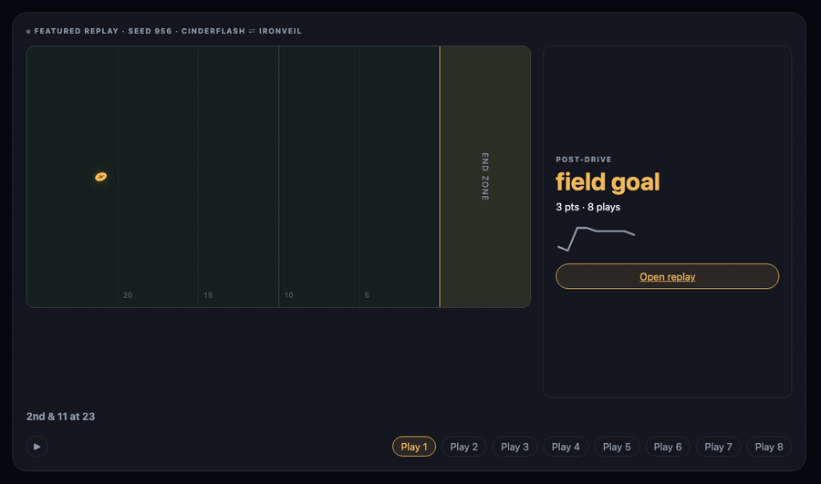
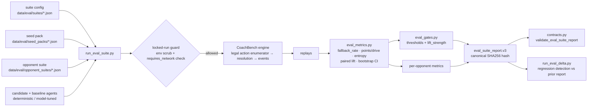

# CoachBench

CoachBench is a football-inspired adversarial-agent arena for short red-zone strategy contests. Coordinator agents compete through simultaneous legal calls, scarce tactical resources, partial observations, belief updates, graph-backed tactical events, and seeded reproducibility.

> Can your agent discover the edge before the opponent adjusts?

## Demo Preview

<p align="center">
  
</p>

Seed 956 shows an eight-play red-zone drive from the home-page field view, sped up for a short README loop.

## Architecture



## Quick Start

```bash
make demo
```

Then open:

```text
http://localhost:8000/ui/
```

Useful commands:

```bash
make test
make showcase
make golden-update
make baseline-update
```

Manual equivalent:

```bash
python scripts/run_showcase.py --seed 42 --out data/demo_replay.json --copy-ui
python scripts/run_match_matrix.py --out data/match_matrix_report.json
python scripts/run_daily_slate.py --slate data/daily_slate/sample_slate.json --out data/daily_slate/results.json
python -m http.server 8000
```

Local backend env defaults live in `.env.example`. Live Assistant model calls require `LLM_VIRAL_SPIKE_COST_CEILING_USD` to be set to a real launch ceiling, plus session, IP-window, concurrency, kill-switch, model, timeout, and server-side API-key settings. The deterministic Assistant stub remains the fallback when the model path is killed, over budget, unavailable, or invalid.

## Evaluation Suite

A unified, contract-first surface for measuring agent performance.

### Available suites

| Suite | Seeds | Opponents | Use case | Runtime |
|---|---:|---:|---|---|
| smoke | 5 | 1 | Fast CI signal; locked-mode default | ~5s |
| standard | 64 | 5 | Paired comparison vs Garage archetypes | ~60s |
| extended | 256 | 5 | Release-quality claims | ~5min |
| exploit | 5 | 1 | Canary: candidate vs deterministic exploit-probe | ~5s |

### Run

```bash
python scripts/run_eval_suite.py --suite standard --out report.json
python scripts/run_eval_suite.py --suite standard --side defense --out report_def.json
python scripts/run_eval_suite.py --suite smoke --no-locked --candidate agents.model_offense.ModelOffense --out research.json
python scripts/run_eval_delta.py --before before.json --after after.json --out delta.json --fail-on regression
```

### Metrics tracked

- `fallback_rate` per side and per opponent: agent contract health.
- `points_per_drive`, `touchdown_rate`, `paired_seed_lift_mean`, `paired_seed_win_rate`, `bootstrap_ci_95`.
- `concept_frequency`, `concept_entropy`: strategy diversity.
- `resource_exhaustion_rate`, `calibration_summary` when matchup traits are active.
- `lift_strength`: `none`, `confirmed`, or `strong`, a bootstrap-CI-aware aggregate signal.

### Gates

- `--fail-on {never, warning, error}` wires runner exit codes to objective thresholds.
- Smoke fails on any fallback; standard fails at `fallback_rate > 0.01`; extended fails at `fallback_rate > 0.001`.
- Locked runs scrub known LLM env vars and reject agents declaring `requires_network=True`.

## Engineering Principles

Built across five contract-driven phases. **504 passing tests, 3 skipped (live-API gated).**

- **Contract-first.** Every report shape is validated by [`engine/coachbench/contracts.py`](engine/coachbench/contracts.py). Schemas are versioned (`eval_suite_report.v3`, `eval_delta_report.v1`); old versions are rejected with explicit migration errors.
- **Deterministic.** Two runs of the same suite produce bit-identical report hashes. Canonical JSON serialization, sorted keys, explicit volatile-field exclusion.
- **Gate-enforced.** Lift claims require >= 80% paired-seed win rate; strong-lift claims require bootstrap 95% CI excluding zero. Gate evaluation is pure ([`engine/coachbench/eval_gates.py`](engine/coachbench/eval_gates.py)); the runner inserts but does not mutate.
- **Locked-run by default.** [`engine/coachbench/locked_eval.py`](engine/coachbench/locked_eval.py) scrubs known LLM env vars and rejects network-requiring agents at load time. Research mode requires `--no-locked`.
- **Adversarial coverage.** Six pathological observation fixtures parameterized across six agent types verify fallback contracts under depleted resources, single-legal-action constraints, malformed beliefs, and terminal-adjacent states.

## Included Pieces

```text
Strategy graph v0
Legal action enumerator
Resource feasibility validation
Concept interaction engine
Static and adaptive starter agents
Fictional launch identities over technical baseline configs
Engine-generated showcase replay
Best-of-N and comparison reports
Golden replay drift tests
Calibration sanity ranges
Agent Garage display and local edit shell
Film Room structured notes
Daily Slate local report
Zero-dependency replay UI
```

## Agent Garage

Agent Garage ships eight fictional presets built only from live, tested knobs:

```text
Offense: Efficiency Optimizer, Aggressive Shot-Taker, Misdirection Artist, Run-Game Builder
Defense: Coverage Shell Conservative, Pressure-Look Defender, Disguise Specialist, Man-Coverage Bully
```

Each preset in `agent_garage/profiles.json` includes a one-line strategic intent, live parameters, aggregate expected-behavior signatures, and a known counter validated across the fixed garage seed pack.

Launch identities are fictional; tactical behavior is inherited from the Agent Garage archetype and the strategy graph, not from prose.

The 2.5 loop is closed for static Tier 0 runs: Film Room emits structured, event-derived tweak chips; Apply Suggested Tweak opens Garage with the matching live knob pre-moved and highlighted; Run Test Drive records the parent run and replay detail shows a scoped before/after panel for the affected signal. Runs still resolve to the nearest pre-baked replay matrix entry. Arbitrary custom-config execution is intentionally deferred to Phase 2.75.

## Repo Map

```text
PLAN.md                         product/build plan
AGENTS.md                       coding-agent operating instructions
CLAUDE.md                       Claude Code operating instructions
engine/coachbench/              core symbolic engine
agents/                         starter coordinator agents
graph/redzone_v0/               graph cards and resource constraints
scripts/                        local run and evaluation utilities
data/                           generated replays, reports, baselines
ui/                             zero-dependency replay UI
docs/                           product and safety notes
tests/                          smoke, contract, drift, calibration tests
```

## Product Boundary

CoachBench is a fictional, local-first strategy benchmark. Do not add AGENTS.md-prohibited identity, league, rating, monetization, or hosted third-party execution scope without the required design review.

## Quality Gates

```bash
python -m pytest -q
python scripts/run_showcase.py --seed 42 --out data/demo_replay.json --copy-ui
python scripts/run_match_matrix.py --out data/match_matrix_report.json
python scripts/run_daily_slate.py --slate data/daily_slate/sample_slate.json --out data/daily_slate/results.json
```

## Backlog

Rookie Pools and Social Share remain parked in `docs/backlog.md` until the core player loop is validated.
